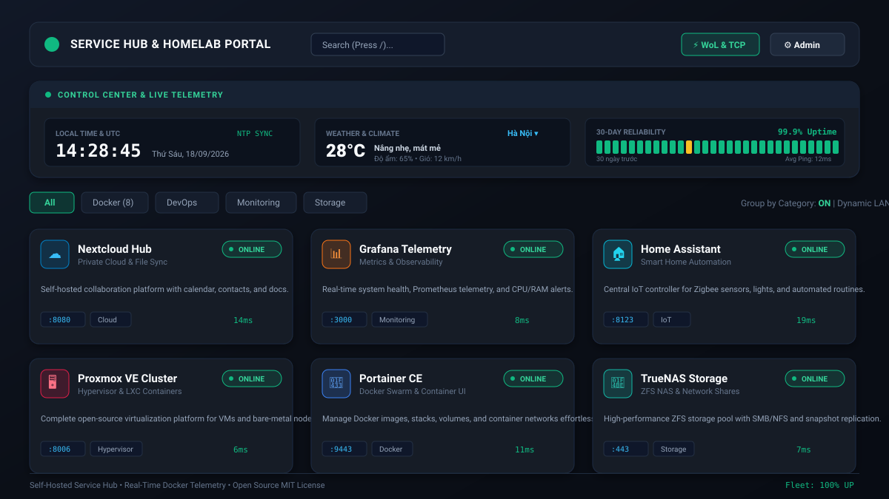
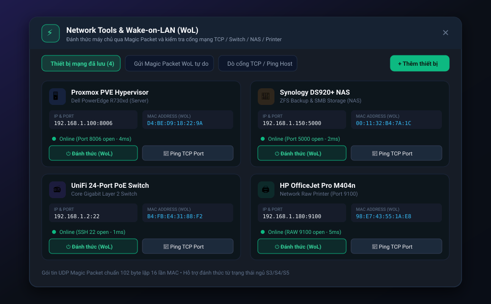
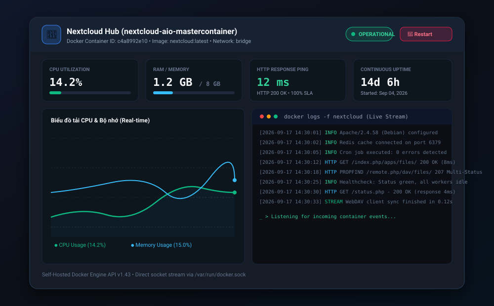

<div align="center">

# 🌐 Service Hub & Homelab Project Portal

**Cổng quản lý dịch vụ tự lưu trữ (Self-Hosted), giám sát container Docker thời gian thực và trung tâm điều khiển hạ tầng mạng Homelab.**

[](LICENSE)
[](https://www.docker.com/)
[](SECURITY.md)
[](https://reactjs.org/)
[](https://www.typescriptlang.org/)
[](https://nodejs.org/)
[](https://tailwindcss.com/)
[](https://github.com)

<br />

<p align="center">
  <a href="#-triển-khai-siêu-tốc-với-docker-compose-1-phút">🚀 Triển khai nhanh</a> •
  <a href="#-tính-năng-nổi-bật">🌟 Tính năng nổi bật</a> •
  <a href="#-ảnh-chụp-màn-hình-demo">📸 Giao diện Demo</a> •
  <a href="#-cấu-hình-biến-môi-trường">⚙️ Biến môi trường</a> •
  <a href="#-tài-liệu-hướng-dẫn-chuyên-sâu">📖 Tài liệu chuyên sâu</a> •
  <a href="#-khuyến-nghị-vận-hành--bảo-mật">🛡️ Bảo mật &amp; Hardening</a>
</p>

---



</div>

<br />

## 📖 Giới thiệu tổng quan

**Service Hub & Homelab Project Portal** là một ứng dụng Web Dashboard hiện đại, nhẹ và trực quan, được thiết kế chuyên biệt cho các kỹ sư DevOps, quản trị viên hệ thống và cộng đồng đam mê **Homelab / Self-Hosted**.

Thay vì phải ghi nhớ hàng chục cổng port (`:8080`, `:9000`, `:8123`, `:3000`...) hay lưu hàng loạt bookmark rời rạc trong trình duyệt, **Service Hub** tổng hợp toàn bộ các máy chủ, dịch vụ Docker, NAS, máy in và switch thành một trang điều hướng tập trung, có hỗ trợ đo đạc trạng thái trực tiếp (Health Check), hiển thị lịch sử hoạt động 30 ngày (chuẩn Uptime Kuma) và đánh thức máy chủ từ xa qua **Wake-on-LAN (WoL)**.

---

## 🌟 Tính năng nổi bật

### 1. 🎛️ Trang Flashcard Công cộng & Điều hướng nhanh
- **Thẻ dịch vụ thông minh**: Hiển thị tên dịch vụ, mô tả ngắn, cổng port, danh mục phân loại, biểu tượng tùy biến và thẻ tag.
- **Kiểm tra trạng thái thời gian thực (Live Health Check)**: Đo độ trễ kết nối (Ping ms), HTTP Status code (200 OK), phát hiện sự cố ngay khi dịch vụ bị sập.
- **Bộ lọc & Tìm kiếm tức thì**: Tìm kiếm theo tên, port, tag hoặc danh mục với phím tắt nhanh: bấm `/` hoặc `Ctrl + K` / `Cmd + K`.
- **Ghim dịch vụ yêu thích (Pinned Services)**: Lưu các dịch vụ thường dùng lên đầu trang, tự động ghi nhớ trên từng trình duyệt.
- **Dynamic LAN Host Switcher**: Tự động thay thế `localhost` bằng địa chỉ IP/Hostname thực tế của máy chủ khi bạn truy cập từ điện thoại hoặc máy tính khác trong mạng nội bộ.

### 2. 📊 Mini-Dashboard & Trực quan hóa Uptime 30 ngày
- **Đồng hồ số thời gian thực**: Hiển thị giờ chuẩn hệ thống, giây nhảy thời gian thực và đồng hồ quốc tế UTC.
- **Widget thời tiết tự động**: Cập nhật nhiệt độ, độ ẩm, sức gió và dự báo tại các thành phố lớn (Hà Nội, TP. HCM, Đà Nẵng, Tokyo, Singapore...), hỗ trợ chuyển đổi linh hoạt °C / °F.
- **Lịch sử Uptime 30 ngày (Chuẩn Uptime Kuma)**: 30 khối trạng thái màu trực quan cho từng ngày; di chuột để kiểm tra ngày tháng, tỷ lệ SLA (%) và thời gian phản hồi.
- **Chế độ thu gọn (Compact/Collapse)**: Cho phép thu nhỏ dashboard thành thanh trạng thái thanh mảnh để tối ưu không gian hiển thị.

### 3. ⚡ Wake-on-LAN (WoL) & Dò cổng TCP (Network Prober)
- **Gửi gói tin Magic Packet chuẩn UDP**: Tự động đóng gói chuỗi 102-byte (6 byte `0xFF` + 16 lần lặp MAC) phát sóng qua địa chỉ Broadcast để đánh thức máy chủ/PC đang ngủ (S3/S4/S5).
- **Quản lý thiết bị mạng nội bộ**: Lưu trữ danh bạ NAS, Proxmox Hypervisor, Switch, Máy in mạng với nút bấm **"Đánh thức"** và **"Kiểm tra cổng"** 1-chạm.
- **Dò cổng TCP (TCP Ping)**: Kiểm tra trạng thái đóng/mở của bất kỳ cổng nào (SSH 22, Web 80/443, SMB 445, Raw Print 9100, Proxmox 8006...) kèm đo độ trễ round-trip mili-giây.

### 4. 🐳 Tự động phát hiện Docker (Docker Socket Auto-Discovery)
- **Nhận diện tự động qua Docker Engine**: Đọc thông tin các container đang chạy trên host thông qua `/var/run/docker.sock` ở chế độ read-only.
- **Tự động trích xuất cấu hình**: Đọc tên container, image, cổng port công khai (`PublicPort`), nhãn `servicehub.*` và trạng thái container.
- **Thêm vào Portal chỉ bằng 1 click**: Biến bất kỳ container Docker nào thành một flashcard hoàn chỉnh trong nháy mắt.

### 5. 📈 Giám sát Chi tiết (Deep Telemetry) & Xem Log Container
- Bấm vào bất kỳ flashcard nào để mở giao diện giám sát chuyên sâu:
  - **Biểu đồ tải CPU & RAM trực tiếp (Real-time charts)**.
  - **Dung lượng bộ nhớ & Thời gian hoạt động liên tục (Uptime)**.
  - **Xem nhật ký log trực tiếp của container (Docker Live Logs stream)**.
  - **Nút Khởi động lại container (Restart Container)** an toàn ngay từ giao diện.

### 6. 🔐 Quản trị & Webhook Tự động hóa CI/CD
- **Bảo mật xác thực Admin**: Quản trị bằng mật khẩu băm bảo mật và token JWT.
- **Kéo thả sắp xếp thứ tự (Reorder)**: Sắp xếp vị trí xuất hiện của từng thẻ theo ý muốn.
- **Sao lưu & Phục hồi JSON**: Xuất file backup JSON toàn bộ danh sách dịch vụ chỉ với 1 nút bấm, nhập lại dễ dàng khi chuyển máy chủ.
- **REST Webhook API**: Cho phép các file `docker-compose.yml` hoặc pipeline CI/CD tự động gửi yêu cầu đăng ký dịch vụ mới vào portal.

---

## 📸 Ảnh chụp màn hình Demo

### 1. Giao diện Dashboard chính & Mini Control Center
> *Hiển thị bảng điều khiển Mini-Dashboard thời tiết, đồng hồ NTP, Uptime 30 ngày và lưới thẻ dịch vụ.*


---

### 2. Trung tâm công cụ mạng Wake-on-LAN & TCP Ping
> *Quản lý danh bạ thiết bị mạng, gửi gói tin Magic Packet đánh thức máy chủ và đo độ trễ kết nối TCP.*



---

### 3. Cửa sổ giám sát chi tiết CPU, RAM & Stream Log Container
> *Xem biểu đồ tài nguyên thời gian thực và theo dõi luồng nhật ký log của container Docker.*



---

## 🚀 Triển khai siêu tốc với Docker Compose (1 phút)

Đây là cách cài đặt dễ nhất, nhanh nhất và khuyến nghị cho người mới bắt đầu.

### Bước 1: Tạo thư mục và file `docker-compose.yml`

Tạo một thư mục mới trên máy chủ của bạn (ví dụ VPS, Raspberry Pi, hoặc máy bàn chạy Ubuntu/Debian):

```bash
mkdir -p ~/service-hub && cd ~/service-hub
nano docker-compose.yml
```

Dán nội dung sau vào file `docker-compose.yml`:

```yaml
version: '3.8'

services:
  service-portal:
    image: ghcr.io/your-username/service-hub-portal:latest
    # Hoặc tự build từ source nếu clone git:
    # build: .
    container_name: service-hub-portal
    restart: unless-stopped
    ports:
      - "3000:3000"
    environment:
      - NODE_ENV=production
      - PORT=3000
      - ADMIN_PASSWORD=admin123_doi_ngay_khi_dung # Thay mật khẩu quản trị của bạn
      - JWT_SECRET=tao_mot_chuoi_ngau_nhien_that_dai_o_day_nhe
      - DOCKER_SOCKET_PATH=/var/run/docker.sock
    volumes:
      # Nơi lưu trữ danh sách dịch vụ và cấu hình (không bị mất khi restart)
      - ./data:/app/data
      # Mount Docker socket để tự động phát hiện các container trên máy chủ
      - /var/run/docker.sock:/var/run/docker.sock:ro
    healthcheck:
      test: ["CMD", "wget", "--no-verbose", "--tries=1", "--spider", "http://localhost:3000/api/services"]
      interval: 30s
      timeout: 5s
      retries: 3
    networks:
      - portal-net

networks:
  portal-net:
    driver: bridge
```

### Bước 2: Khởi chạy container

```bash
docker compose up -d
```

### Bước 3: Truy cập ứng dụng

Mở trình duyệt web của bạn và truy cập:
- Trên chính máy chủ: `http://localhost:3000`
- Từ máy tính khác trong mạng LAN: `http://<IP_MÁY_CHỦ>:3000` (Ví dụ: `http://192.168.1.50:3000`)
- **Tài khoản quản trị mặc định**:
  - Tên đăng nhập: `admin`
  - Mật khẩu: Giá trị bạn đã đặt ở `ADMIN_PASSWORD` (mặc định là `admin123_doi_ngay_khi_dung`)

---

## 🛠️ Cài đặt thủ công với Node.js (Bare-Metal)

Nếu bạn không sử dụng Docker và muốn chạy trực tiếp bằng Node.js trên máy chủ Linux, macOS hoặc Windows:

### Yêu cầu hệ thống:
- **Node.js**: Phiên bản 20.x trở lên ([Tải tại nodejs.org](https://nodejs.org/))
- **npm**: Đi kèm với Node.js

### Các bước cài đặt:

```bash
# 1. Clone repository về máy
git clone https://github.com/your-username/service-hub-portal.git
cd service-hub-portal

# 2. Cài đặt các gói phụ thuộc
npm install

# 3. Tạo file cấu hình môi trường .env
cp .env.example .env
nano .env

# 4. Biên dịch mã nguồn cho bản sản xuất (Production Build)
npm run build

# 5. Khởi chạy server
npm run start
```

Ứng dụng sẽ hoạt động tại cổng `http://localhost:3000`.

---

## ⚙️ Cấu hình biến môi trường (`.env`)

Bạn có thể tùy chỉnh các tham số hoạt động của hệ thống bằng file `.env` hoặc trong mục `environment` của `docker-compose.yml`:

| Biến môi trường | Mặc định | Bắt buộc | Ý nghĩa và mô tả |
| :--- | :--- | :---: | :--- |
| `PORT` | `3000` | Không | Cổng HTTP mà máy chủ Node/Express lắng nghe. |
| `NODE_ENV` | `production` | Không | Chế độ môi trường (`development` hoặc `production`). |
| `ADMIN_PASSWORD` | `admin` | **Khuyến nghị** | Mật khẩu tài khoản quản trị `admin`. Hãy đổi ngay khi triển khai công khai. |
| `JWT_SECRET` | *(tự sinh ngẫu nhiên)* | **Khuyến nghị** | Chuỗi bí mật dùng để ký và xác thực phiên đăng nhập (Token JWT). |
| `DOCKER_SOCKET_PATH` | `/var/run/docker.sock` | Không | Đường dẫn socket Docker trên máy chủ để kích hoạt tính năng tự phát hiện container. |
| `DATA_DIR` | `./data` | Không | Thư mục lưu trữ cơ sở dữ liệu JSON cho các dịch vụ và thiết bị mạng. |

---

## 📡 Tự động đăng ký dịch vụ qua Webhook API (CI/CD)

Bạn có thể tự động thêm hoặc cập nhật thẻ dịch vụ vào Service Hub mỗi khi một container mới được deploy xong thông qua Webhook HTTP POST:

### Endpoint:
```http
POST /api/webhook/service
Content-Type: application/json
X-Webhook-Token: <TOKEN_LẤY_TRONG_ADMIN_SETTINGS>
```

### Ví dụ Payload đăng ký:
```json
{
  "name": "qBittorrent",
  "title": "qBittorrent WebUI",
  "description": "Trình tải torrent giao diện web với cổng kết nối an toàn",
  "url": "http://192.168.1.50:8085",
  "category": "Download",
  "icon": "Download",
  "port": 8085,
  "healthCheckUrl": "http://192.168.1.50:8085",
  "tags": ["torrent", "p2p", "media"]
}
```

### Ví dụ gọi lệnh bằng `curl`:
```bash
curl -X POST http://localhost:3000/api/webhook/service \
  -H "Content-Type: application/json" \
  -H "X-Webhook-Token: your_secret_webhook_token_here" \
  -d '{
    "name": "Nginx Proxy Manager",
    "url": "http://192.168.1.50:81",
    "category": "Networking",
    "icon": "Globe",
    "port": 81
  }'
```

---

## 📖 Tài liệu hướng dẫn chuyên sâu

Dự án cung cấp bộ tài liệu chi tiết từng chủ đề trong thư mục [`docs/`](./docs):

- 🔰 **[Hướng dẫn cho người mới bắt đầu (Getting Started)](./docs/GETTING_STARTED.md)**: Hướng dẫn từ A-Z cách dựng máy chủ, phân quyền, cấu hình reverse proxy Nginx / Cloudflare Tunnel có SSL HTTPS.
- 🛡️ **[Chính sách & Báo cáo Lỗ hổng Bảo mật (SECURITY.md)](./SECURITY.md)**: Quy trình Responsible Disclosure, mô hình nguy cơ và tiêu chuẩn an ninh.
- 🔒 **[Hướng dẫn Thắt chặt An ninh Chuyên sâu (Security Hardening)](./docs/SECURITY_HARDENING.md)**: Cẩm nang phòng thủ đa lớp, bảo vệ Docker socket, chống SSRF, cấu hình Reverse Proxy và Checklist 10 bước Go-Live.
- 🐳 **[Tích hợp Docker Engine & Nhãn labels (Docker Integration)](./docs/DOCKER_INTEGRATION.md)**: Cách sử dụng Docker labels `servicehub.enable=true` để tự động hóa danh mục và icon.
- ⚡ **[Hướng dẫn cấu hình Wake-on-LAN & Mạng (WoL & Network Guide)](./docs/WOL_AND_NETWORK.md)**: Cách bật WoL trong BIOS bo mạch chủ, cấu hình card mạng trên Windows/Linux, thiết lập Broadcast IP qua các VLAN.
- 📚 **[Tài liệu đặc tả REST API (API Reference)](./docs/API_REFERENCE.md)**: Chi tiết toàn bộ endpoints, mã phản hồi HTTP và mẫu dữ liệu JSON.

---

## 🛡️ Khuyến nghị Vận hành & Bảo mật Toàn diện

> ⚠️ **CẢNH BÁO BẢO MẬT KHI TRIỂN KHAI:**
> Khi vận hành trong mạng gia đình hoặc máy chủ VPS, hãy luôn tuân thủ các nguyên tắc bảo vệ cốt lõi sau đây:

1. **Thay đổi Mật khẩu Quản trị ngay**:
   - Không sử dụng mật khẩu mặc định `admin123_doi_ngay_khi_dung`. Đổi mật khẩu ngay tại tab **Settings** hoặc qua biến `ADMIN_PASSWORD` trong file `.env`.
   - Hệ thống tự động kích hoạt **Anti-Brute Force Lockout**: Khóa tạm thời 15 phút nếu nhập sai mật khẩu 5 lần liên tiếp.

2. **Tạo chuỗi ngẫu nhiên cho `JWT_SECRET`**:
   - Tạo khóa tối thiểu 32 ký tự (`openssl rand -base64 32`) để đảm bảo session token không thể bị giả mạo.

3. **Bảo vệ Docker Socket an toàn**:
   - Trong file `docker-compose.yml`, socket Docker **bắt buộc** phải có cờ `:ro` (`/var/run/docker.sock:/var/run/docker.sock:ro`). Ứng dụng chỉ sử dụng các truy vấn đọc thông tin (GET), không bao giờ thực thi lệnh nguy hiểm lên máy chủ host.
   - Đối với môi trường bảo mật cao, bạn có thể triển khai trung gian qua **Docker Socket Proxy** (`tecnativa/docker-socket-proxy`).

4. **Tránh mở cổng (Port Forwarding) 3000 trực tiếp trên Router**:
   - Không nên NAT cổng 3000 ra ngoài Internet. Hãy sử dụng **Cloudflare Tunnel (Zero Trust)** hoặc mạng riêng ảo **Tailscale / WireGuard** để truy cập an toàn mà không để lộ địa chỉ IP thật của máy chủ.

5. **Bảo vệ SSRF & Giới hạn tần suất (Rate Limiting)**:
   - Tính năng dò cổng TCP tự động chặn mọi yêu cầu truy vấn đến địa chỉ Cloud Metadata nhạy cảm (`169.254.169.254`).
   - Các công cụ mạng (WoL và TCP Ping) được giới hạn tần suất theo từng IP để ngăn chặn nguy cơ DoS mạng nội bộ.

6. **Công cụ Tự kiểm toán An ninh (Built-in Security Audit)**:
   - Hệ thống tích hợp sẵn trang kiểm toán tại tab **"Security Audit"** trong Admin Panel (cùng API `/api/admin/security-audit`). Hãy kiểm tra để đảm bảo hệ thống đạt mức an toàn **Grade A** trước khi chia sẻ liên kết!

---

## 🤝 Đóng góp & Phát triển (Contributing)

Mọi đóng góp, báo cáo lỗi (Issue) hoặc đề xuất tính năng mới (Pull Request) đều được hoan nghênh!

```bash
# Chạy môi trường phát triển (Hot reload)
npm run dev

# Kiểm tra cú pháp và kiểu TypeScript
npm run lint

# Build bản sản xuất
npm run build
```

---

## 📄 Giấy phép (License)

Dự án được phát hành theo giấy phép mã nguồn mở **[MIT License](LICENSE)**. Bạn có quyền tự do sử dụng, chỉnh sửa, phân phối lại cho mục đích cá nhân hoặc thương mại.

<div align="center">
  <sub>Được phát triển với niềm đam mê dành cho cộng đồng Self-Hosted &amp; Homelab. Chúc hệ thống của bạn luôn 99.99% Uptime! 🚀</sub>
</div>
